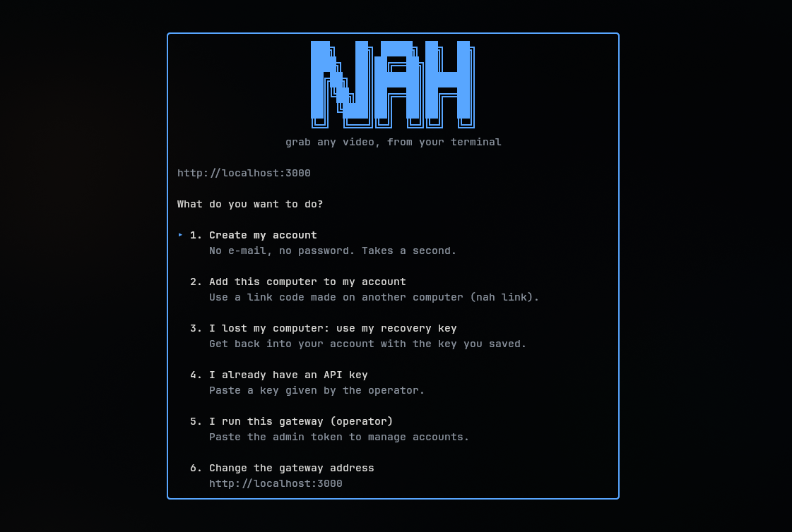
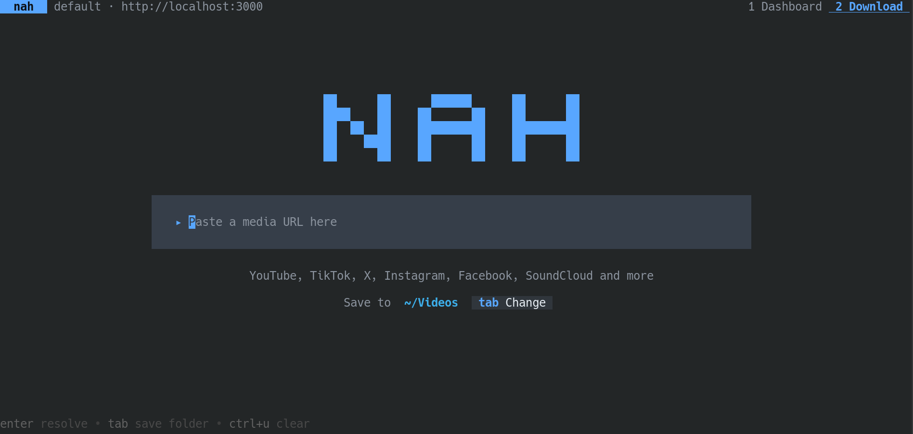
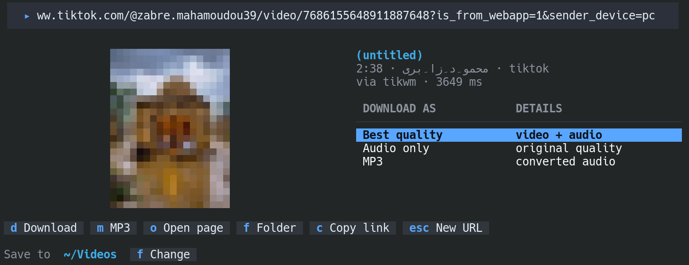
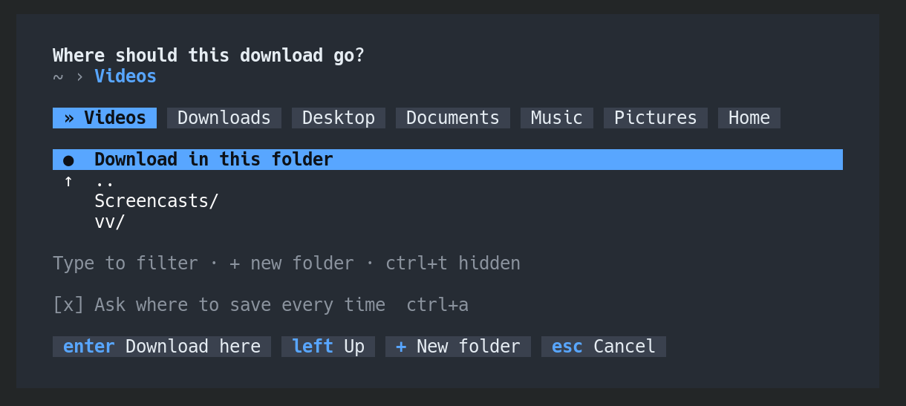

# nah

The command line and terminal interface for [NICE-API'HUB](../../README.md).

One static binary (Go, no runtime needed), two ways to use it:

- **A full-screen interface**: type `nah`. Tabs, rows and buttons work with the keyboard and the mouse.
- **Commands** for scripts and quick jobs: `nah download`, `nah keys`, `nah admin …`, with `--json` and meaningful exit codes.

Built with [Bubble Tea](https://github.com/charmbracelet/bubbletea), Bubbles, Lip Gloss and Cobra.

**Contents:** [Install](#install) · [First run](#first-run) · [The interface](#the-interface) · [Commands](#commands) ·
[Accounts, computers and keys](#accounts-computers-and-keys) · [Files and settings](#files-and-settings) ·
[Platform notes](#platform-notes) · [Scripting](#scripting) · [Security](#security) · [Development](#development)

## Install

Needs Go 1.26 or newer. There are no prebuilt releases yet.

```bash
cd apps/cli
make build            # ./bin/nah
make install          # into $GOBIN (~/go/bin): make sure that folder is on your PATH
make dist             # release binaries into ./dist (+ SHA256SUMS), see the table below
```

| `make dist` produces | |
|---|---|
| Linux | amd64, arm64 |
| macOS | amd64 (Intel), arm64 (Apple Silicon) |
| Windows | amd64 |

Shell completion: `nah completion bash|zsh|fish|powershell`.

## First run

```bash
nah
```

The gateway address defaults to `http://localhost:3000`. Point at another one with `nah init https://gateway.example`,
`--url`, or `NAH_URL`.

A computer without an account lands on a welcome screen:

<p align="center"></p>

| Choice | What happens |
|---|---|
| **Create my account** | Registers this computer, no e-mail, no password (about a second). Shows a **recovery key once**: `c` copies it, `s` saves it to a file, `Enter` continues (it warns you if you did neither). |
| **Add this computer to my account** | Type the one-time code printed by `nah link` on a computer that already has the account. |
| **Use my recovery key** | You lost a computer: the recovery key gets you a key for this one. |
| **I already have an API key** | Paste a key you were given. It is checked before it is saved. |
| **I run this gateway (operator)** | Paste the admin token. Kept in the system keychain. |
| **Change the gateway address** | Point at another gateway. |

Creating an account is only offered when the gateway allows it (`SIGNUP_MODE` is `open` or `invite`).
After that, `nah` opens straight on the download screen.

No terminal UI? `nah register`, `nah link`, `nah recover` and `nah login` do the same from the command line.

## The interface

Open it with `nah` (or `nah tui`). Tabs depend on what this computer can do: **Dashboard** always; **Accounts** with the
admin token; **Download** with an API key. It opens on Download: a big input in the middle of the screen (like a search page)
where you paste a link. Content stays in a readable centred column, even on a very wide terminal.

<p align="center"></p>

**With the mouse:** click a tab in the top right; click a row to select it; click the highlighted row again to download it;
click the buttons under a list; use the wheel to scroll. Hold `Shift` to select text with the mouse (the terminal gives the
mouse to the app otherwise).

| Key | Action |
|---|---|
| `1` `2` `3` · `[` `]` | Switch tabs |
| `?` · `q` · `ctrl+c` | Full help · quit · quit (also cancels a download) |
| **Download screen** `Enter` | Resolve the link you pasted |
| `↑` `↓` · `d` · `m` · `c` · `Esc` | Select a quality · download · MP3 · copy link · new link |
| `o` on a result | Open the original page in the browser |
| `Tab` (or `f` on a result) | Choose the folder to save into (also asked automatically when a download starts) |
| **Dashboard** `r` | Refresh (it also refreshes every 15 s) |
| **Accounts** `↑` `↓` `Tab` | Move · switch between accounts and keys |
| `n` · `c` · `x` · `s` · `r` | New account · new key · revoke key · suspend/activate · refresh |
| **Operator without a personal account** `s` | Set this computer up as a user too |

**Round corners.** A terminal cell is a rectangle, so a truly round corner needs a special glyph. With a Nerd Font, press
**`Ctrl+R`**: the input bar, buttons and chips become real pills with half-circle ends (press it again to go back; the choice is
remembered). Without such a font, the input is a flat filled field, which looks right in every font.

**Text too small, or not to your taste?** The font and its size belong to your terminal, not to `nah`: zoom with `Ctrl` `+`
(`Cmd` `+` on macOS), or pick a font in the terminal's settings. Good choices: JetBrains Mono, Cascadia Code, Fira Code, or their
Nerd Font variants.

A new key is displayed once, with a copy shortcut. Revocations and suspensions ask for `y` first. While you type in a text
box, single-letter shortcuts are off, so a link containing a `q` never quits the app. A terminal smaller than 60×14
shows a message instead of a broken layout.

### The overview

<p align="center"></p>

Once a link is resolved, you see what you are about to download before choosing anything: a **preview image**, the title, who
made it, its length and the platform, then a short menu in plain words: *Best quality*, each available height (`1080p`, `720p`…
with its approximate size), *Audio only* and *MP3*. `o` opens the original page in your browser.

With room (about 100 columns), the image sits beside the title and the menu; on a narrower terminal it goes above them. The image
is drawn with coloured half blocks, so it works in every terminal that has colour, over SSH and inside tmux, with no graphics
protocol. It is coarse by nature (a few dozen pixels wide); the gateway fetches it, so the CDN never sees your address. If a
platform has no preview, or it cannot be loaded, the screen simply omits it.

### Choosing where files go

<p align="center"></p>

**Starting a download asks where to save it.** Pick a quality, press `d` (or `m` for MP3, or click a row twice): the folder picker
opens right then, on the folder you used last. `Enter` accepts it, so the fast path is *pick, Enter, Enter*. Your choice becomes
the new default and is remembered, along with your most recent folders.

Don't want the question every time? Untick **Ask where to save every time** (click it, or `Ctrl+A`): downloads then go straight to
your default folder. The picker is still one keystroke away: `Tab` on the home screen (`f` once you have a result), or click the
`Save to` line under the input.

One rule does most of the work: **the first row is always "Save in this folder"**. So `Enter` on a folder opens it, then
`Enter` again saves there. Everything else is a shortcut:

| To | Do |
|---|---|
| Move | `↑` `↓` `PgUp` `PgDn` `Home` `End`, or the wheel |
| Go into the highlighted folder / go up | `→` (or `Enter`) / `←` or `Backspace` |
| Filter the folders here | Just type. The cursor jumps to the first match, `Enter` opens it |
| Jump to a path | Type or paste one (`/srv/media`, `~/Videos`, `C:\Users\me`): `Tab` completes it, `Enter` goes there |
| Jump to a usual place | The row of shortcuts above the list (recent folders `»`, Downloads, Documents, Videos/Movies, Music, external drives, Windows drives, `/`). By keyboard: `↑` from the top of the list, or `Tab`, moves onto it; `←` `→` choose (the row scrolls when it does not fit, `‹` `›` show more), `Enter` goes there, `↓` or `Esc` gives the list back. Or click one |
| Jump to a parent | Click any part of the path at the top (`~ › Videos › 2026`) |
| Create a folder | `+`, type a name, `Enter`: you land inside it |
| Show hidden folders | `Ctrl+T` (typing a `.` also reveals them) |
| Cancel | `Esc` (the first press clears the filter) |

A folder you cannot write to is refused with the reason, instead of failing later during a download. Folder names you create are
made safe for every operating system, like downloaded file names.

Not in the interface yet: History, Devices and Settings tabs. Use `nah history`, `nah again` and `nah keys` meanwhile.

## Commands

**Everyone**

| Command | What it does |
|---|---|
| `nah` · `nah tui` | Open the interface |
| `nah media <url>` | Resolve a link into variants. `--url-only [--kind audio]` prints just a link |
| `nah download <url>` | One playable file (video and audio merged, or MP3). `-o`, `--max-height 720`, `--audio`, `--mp3`, `-f`, `-q` |
| `nah history` · `nah again [#\|id]` | What this computer downloaded (`-n`, `--clear`) · download one again, without overwriting |
| `nah jobs submit <url>` | Asynchronous extraction. `--wait`, `--webhook URL`, `--idempotency-key K`; then `jobs get\|wait <id>` |
| `nah account` · `nah usage` | Plan, limits, webhook secret (`--show-secret`), today's quota and recent usage |
| `nah status` | Gateway health and platform availability (needs no credentials). Exits `1` if something is down |
| `nah version` · `nah config show\|list\|use\|path` | Version · inspect and switch profiles |

**Accounts and computers**

| Command | What it does |
|---|---|
| `nah init [url]` | Check a gateway, remember its address, create your account if it allows it |
| `nah register` | Create an account for this computer. `--name`, `--invite`, `--save-recovery DIR` |
| `nah link` | On a computer with the account: print a one-time code (valid 10 minutes, single use) |
| `nah link <code>` | On a new computer: join that account |
| `nah recover` | Use your recovery key on a new computer (`--stdin` to pipe it) |
| `nah keys list\|create\|revoke\|rotate` | Your keys. An id prefix is enough. `create <label> --scope media --scope keys` |
| `nah login` | Store an API key and/or admin token you already have (checked first) |

**Operator** (admin token)

| Command | What it does |
|---|---|
| `nah admin plans` | List plans |
| `nah admin accounts list\|get\|create\|suspend\|activate\|set-plan` | Manage customers. Accounts can be referenced by id, id prefix, or name |
| `nah admin keys list\|create\|revoke\|rotate` | Issue keys (shown once), revoke, rotate with a grace period |
| `nah admin usage <account>` · `nah admin webhook-secret rotate <account>` | Consumption, signing secret |

Destructive actions (revoke, suspend, rotate a secret, clear the history) ask for confirmation, and refuse to run without
`--yes` when there is no terminal, so a script can never do them by accident.

## Accounts, computers and keys

The gateway identifies a person by their **computer**, not by an e-mail address.

- Every computer has **its own key**. Lose or sell one: revoke just that key (`nah keys revoke <id>`) and the others keep working.
- The gateway only ever sees a **hash of a machine identifier** (and hashes it again with a secret of its own). Registration
  also solves a small proof-of-work puzzle (about 0.1 s on a modern machine, using every core) and is limited to one active
  account per machine. These raise the cost of creating accounts in bulk; they do not make it impossible.
- The **recovery key** is shown once. `nah` never stores it on its own (not in the keychain, not in the config file); the only copy
  it makes is the file *you* choose to save. It can do one thing only: mint a key for a new computer.
- Keys have **scopes**: `media` (download), `keys` (manage keys and link codes), `recover` (recovery only).
- If you lose every computer *and* the recovery key, the account is gone. That is the price of having no e-mail.

## Files and settings

Settings resolve in this order: flag → environment → profile → default.

| Variable | Purpose |
|---|---|
| `NAH_URL` | Gateway address |
| `NAH_API_KEY` · `NAH_ADMIN_TOKEN` | Credentials (they win over anything stored) |
| `NAH_PROFILE` | Which profile to use. Several gateways? `nah login --profile staging`, `nah config use staging` |
| `NAH_CONFIG` | Path of the config file itself |
| `NAH_CONFIG_DIR` · `NAH_DATA_DIR` · `NAH_DOWNLOAD_DIR` | Override the folders below |
| `NAH_DEVICE_ID` | Pretend to be another computer (testing): replaces the machine identifier |
| `NAH_NERD_FONT` | `1` = rounded pills, `0` = flat. Rounded needs a terminal font with Powerline symbols (a Nerd Font), otherwise the ends show as empty boxes, so it is off by default. **Press `Ctrl+R` in the interface to switch it live**; the choice is remembered (this variable overrides it) |
| `NAH_NO_KEYRING` | Skip the system keychain and use the private file (servers, containers, CI) |

| What | Linux | macOS | Windows |
|---|---|---|---|
| Settings (`config.json`) | `~/.config/nah` | `~/Library/Application Support/nah` | `%AppData%\nah` |
| History, install id | `$XDG_DATA_HOME` or `~/.local/share/nah` | `~/Library/Application Support/nah` | `%LocalAppData%\nah` |
| Secrets (API key, admin token) | Secret Service (GNOME Keyring, KWallet) | Keychain | Credential Manager |
| Downloads | `~/Downloads`, else the current folder | same | same |

Everything private is created with owner-only permissions (`0700` folders, `0600` files). Secrets go to the system
keychain when there is one; on a headless machine they fall back to the `0600` config file, and `nah` says so.

## Platform notes

| | Linux | macOS | Windows |
|---|---|---|---|
| Machine identifier | `/etc/machine-id` | `IOPlatformUUID` (`ioreg`, else `sysctl kern.uuid`) | `MachineGuid` (registry) |
| Clipboard | `wl-copy`, `xclip` or `xsel` | `pbcopy` | Win32 API |
| Open a file / show in folder | `xdg-open` | `open` / `open -R` | `rundll32` / `explorer /select,` |

- If a platform has no usable machine identifier (containers, some BSDs), `nah` creates a random one for this installation and
  keeps it in the data folder.
- Copying falls back to the **OSC 52** terminal sequence when no clipboard tool exists, which also copies to *your* computer
  over SSH in most modern terminals.
- File names chosen by a website are cleaned before saving: no folders, none of the characters Windows forbids, no reserved
  names (`CON`, `NUL`…), no trailing dots, at most 150 bytes. `nah` refuses to *open* anything that would run as a program
  (`.exe`, `.bat`, `.sh`, `.app`…); it will only show it in the folder.
- **What was verified:** everything above ran for real on Linux. macOS and Windows are cross-compiled on every CI run and
  their platform-specific code is unit-tested with fake systems, but has **not been run on those systems yet**.

## Scripting

- `--json` prints the API's data as JSON on stdout; **errors then go to stderr as JSON** (`{"error":{"code":…}}`).
- Exit codes: `0` ok · `1` failure · `2` usage error · `3` missing/invalid credentials · `130` cancelled.
- `nah download -q` prints only the saved path. Downloads are written to a `.part` file and renamed on success, so a
  cancelled or failed transfer never leaves a truncated file behind, and `nah download` will not overwrite a file without `-f`.
- Spinners and progress bars go to **stderr** and only when it is a terminal: pipes and CI logs stay clean.
- Clipboard escape sequences are only written when stdout is a terminal.

```bash
URL=$(nah media --url-only --kind audio "$SRC")          # best audio link
nah download "$SRC" --mp3 -q -o ~/Music/                 # -> /home/me/Music/<title>.mp3
nah status --json | jq -r '.platforms[] | select(.status=="down").name'
printf '%s\n' "$KEY" | nah login --api-key-stdin         # non-interactive login
```

## Security

- Secrets are asked without echo, checked against the gateway *before* they are saved, and kept in the system keychain.
- The recovery key is only written to disk if you ask (`s` / `--save-recovery`), as a `0600` file. API keys are never printed except once, at creation.
- The gateway address is the only thing sent besides your key and the links you ask for. The download history is a local file and
  is never sent anywhere.
- Report a vulnerability privately (see [CONTRIBUTING.md](../../CONTRIBUTING.md#reporting-a-security-problem)), not in a public issue.

## Development

```bash
make test        # unit + interface tests
make race        # with the race detector
make vet
```

Layout:

| Path | Role |
|---|---|
| `cmd/` | Cobra commands and the glue to the config file, keychain and interface |
| `internal/api` | Typed gateway client (errors are RFC 9457 problems) |
| `internal/tui` | The Bubble Tea app: views, the clickable `grid`, the setup screen |
| `internal/onboard` | Register / link / recover, shared by the commands and the interface |
| `internal/device` · `internal/vault` · `internal/paths` · `internal/clip` · `internal/opener` | Everything that differs per operating system |
| `internal/pow` | Multi-core proof-of-work solver (must match the gateway's rule) |
| `internal/dl` · `internal/history` | Safe file saving, local download history |
| `internal/config` · `internal/ui` | Profiles and settings · the shared look |

The interface is tested with `teatest` against a fake gateway (tabs, forms, confirmations, downloads) and with direct
mouse events; the commands are tested against `httptest`, including exit codes and the "nothing happens without confirmation"
guarantees. Tests never touch your real keychain, clipboard or config.

**Look and feel:** flat colours only: neutral greys, one accent, colour otherwise reserved for status. The accent lives in
`internal/ui/style.go`. No gradients.
